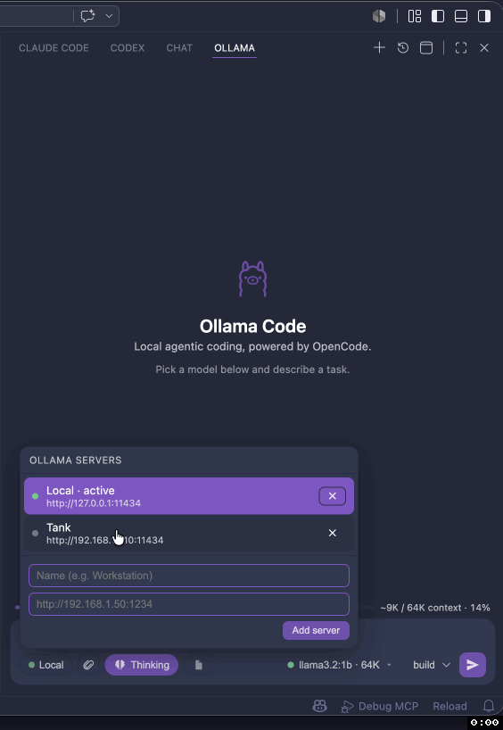

# Ollama Code

An agentic coding panel for **your local [Ollama](https://ollama.com) models** — a Claude Code / Codex–style chat experience that runs entirely on your machine.

Under the hood it drives the open-source [**OpenCode**](https://opencode.ai) agent (Apache/MIT) as a headless server pointed at your Ollama server. You get a real agent — file edits, shell tools, permissions, multi-step reasoning — with no cloud model and no API key.

## Demo



## Why

The official Claude Code and Codex VS Code extensions are **not open source**, so they can't be adapted to local models. The *CLIs* behind several agents are open, though — and OpenCode in particular ships a headless server with a built-in Ollama provider. This extension wraps that server in a native chat panel and fills its model picker with the models you actually have installed.

## Features

- **Chat panel** in the Activity Bar / secondary side bar (and "Open in Editor Tab" for parallel conversations)
- **Streaming** responses with a Claude-style timeline — thinking, tool steps, answer
- **Reasoning** blocks for thinking-capable models (collapsible)
- **Agent tools** — file reads/edits, shell, search — surfaced as collapsible tool cards
- **Permission prompts** — Allow once / Allow always / Deny, inline
- **Model manager** — load / eject Ollama models from the composer, with loaded state, context size, and capability badges (👁 vision / 🔧 tools)
- **Multi-server** — register, switch, and remove Ollama servers; offline mode with a connection banner
- **Context meter** with compaction indicator, **thinking toggle**, **image attachments** for vision models, and the **open file** attached as excludable context
- **Session history** — persistent, resumable, auto-named; delete one or clear all
- **Auto-context** — loads the selected model with an adequate `num_ctx` so OpenCode's large system prompt doesn't overflow Ollama's small default window

## Requirements

- **VS Code** 1.104+
- **[Ollama](https://ollama.com)** installed and running (default `http://127.0.0.1:11434`) with at least one model pulled — e.g. `ollama pull llama3.2` (use a tool-capable model for the agent)

> **[OpenCode](https://opencode.ai) is bundled** — the matching platform binary ships inside the extension, so there's nothing extra to install and it works offline. Power users can point at their own build with `ollamaCode.opencodePath`; an install on your `PATH` or in `~/.opencode/bin` is preferred over the bundled copy if present.

## Quick start

1. Start Ollama and pull a model: `ollama pull llama3.2` (or `qwen3`, `mistral-small`, etc.).
2. Install this extension (or run it from source — see below).
3. Click the Ollama icon in the Activity Bar.
4. Pick a model, type a task, hit Enter.

## Settings

| Setting | Default | Description |
| --- | --- | --- |
| `ollamaCode.ollamaBaseUrl` | `http://127.0.0.1:11434` | Ollama server host (root, no `/v1`) |
| `ollamaCode.opencodePath` | _(bundled)_ | Override path to an `opencode` binary; empty uses your own install (PATH / `~/.opencode`) or the bundled one |
| `ollamaCode.serverPort` | `0` | Embedded server port (0 = auto) |
| `ollamaCode.defaultModel` | _(first)_ | Default model id (e.g. `llama3.2:3b`) |
| `ollamaCode.agent` | `build` | `build` (can edit) or `plan` (read-only) |
| `ollamaCode.autoEnsureContext` | `true` | Load the model with an adequate `num_ctx` before prompting |
| `ollamaCode.minContextLength` | `32768` | Context window (`num_ctx`) to load models with |
| `ollamaCode.keepAlive` | `30m` | Ollama `keep_alive` — how long a model stays loaded |

## How it works

```
VS Code webview (chat UI)
        │  postMessage
        ▼
Extension host (bridge)
        │  HTTP + SSE  (raw fetch)
        ▼
opencode serve  ──native ollama provider──▶  Ollama (/api/chat, local model)
   (OLLAMA_HOST + OPENCODE_CONFIG_CONTENT injected at launch)
```

The extension enumerates your installed models with Ollama's REST API
(`/api/tags`, `/api/show`, `/api/ps`), then augments OpenCode's built-in
`ollama` provider with those models (capabilities, context limit, `num_ctx`)
via the `OPENCODE_CONFIG_CONTENT` environment variable — **nothing is written
to your workspace or global config.** The active server is passed through
`OLLAMA_HOST`. Model load/eject uses `/api/generate` with `keep_alive` and
`options.num_ctx`.

## Develop from source

```bash
npm install
npm run bundle:opencode      # fetch the pinned OpenCode binary into bin/ for your platform
npm run compile              # type-check + bundle (extension + webview)
# then press F5 in VS Code to launch the Extension Development Host
npm run package:vsix:bundled # build a platform .vsix with the binary embedded
```

The OpenCode binary is fetched at build time (pinned by `opencodeVersion` in
`package.json`) and is never committed — `bin/` is git-ignored. Bump that field
to upgrade the bundled OpenCode. F5 also resolves the binary from `bin/`, so run
`bundle:opencode` once before launching the dev host.

## License

MIT
