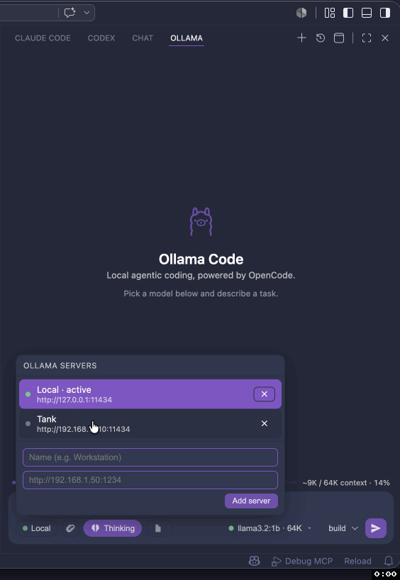

# Ollama Code

An agentic coding panel for **your local [Ollama](https://ollama.com) models** — a Claude Code / Codex–style chat experience that runs entirely on your machine.

Under the hood it drives the open-source [**OpenCode**](https://opencode.ai) agent (Apache/MIT) as a headless server pointed at your Ollama server. You get a real agent — file edits, shell tools, permissions, multi-step reasoning — with no cloud model and no API key.

## Demo



## Why

The official Claude Code and Codex VS Code extensions are **not open source**, so they can't be adapted to local models. The *CLIs* behind several agents are open, though — and OpenCode in particular ships a headless server with a built-in Ollama provider. This extension wraps that server in a native chat panel and fills its model picker with the models you actually have installed.

## Features

- **Chat panel** in the Activity Bar / secondary side bar (and "Open in Editor Tab" for parallel conversations)
- **Streaming** responses with a Claude-style timeline — thinking, tool steps, answer
- **Reasoning** blocks for thinking-capable models (collapsible)
- **Agent tools** — file reads/edits, shell, search — surfaced as collapsible tool cards
- **MCP servers** — extend the agent with [Model Context Protocol](https://modelcontextprotocol.io) tools; servers you already configured for **Claude Code** (`.mcp.json`) or **VS Code** (`.vscode/mcp.json`) are picked up automatically. Type `/mcp` to see their live status
- **Permission prompts** — Allow once / Allow always / Deny, inline; plus a permissions picker in the composer to set how often the agent asks: *Ask: risky only* (the default — outside-the-workspace access and `.env` reads prompt), *Ask: always* (approve every tool call), or *Bypass all* (never ask — for workspaces you trust)
- **Model manager** — load / eject Ollama models from the composer, with loaded state, context size, and capability badges (👁 vision / 🔧 tools)
- **Multi-server** — register, switch, edit, and remove Ollama servers; offline mode with a connection banner
- **Context meter** with compaction indicator, **thinking toggle**, **image attachments** for vision models, and the **open file** attached as excludable context
- **Session history** — persistent, resumable, auto-named; delete one or clear all
- **Auto-context** — loads the selected model with an adequate `num_ctx` so OpenCode's large system prompt doesn't overflow Ollama's small default window

## Requirements

- **VS Code** 1.104+
- **[Ollama](https://ollama.com)** installed and running (default `http://127.0.0.1:11434`) with at least one model pulled — e.g. `ollama pull llama3.2` (use a tool-capable model for the agent)

> **[OpenCode](https://opencode.ai) is bundled** — the matching platform binary ships inside the extension, so there's nothing extra to install and it works offline. Power users can point at their own build with `ollamaCode.opencodePath`; an install on your `PATH` or in `~/.opencode/bin` is preferred over the bundled copy if present.

## Quick start

1. Start Ollama and pull a model: `ollama pull llama3.2` (or `qwen3`, `mistral-small`, etc.).
2. Install this extension (or run it from source — see below).
3. Click the Ollama icon in the Activity Bar.
4. Pick a model, type a task, hit Enter.

### Beta channel

New features ship to the Marketplace **pre-release** channel first (odd minor
versions, e.g. `0.11.x`; stable releases use even minors). To try betas, open
the extension's Marketplace page in VS Code and click **Switch to Pre-Release
Version** — VS Code updates you along the beta track and you can switch back
any time with **Switch to Release Version**.

## Settings

| Setting | Default | Description |
| --- | --- | --- |
| `ollamaCode.ollamaBaseUrl` | `http://127.0.0.1:11434` | Ollama server host (root, no `/v1`) |
| `ollamaCode.opencodePath` | _(bundled)_ | Override path to an `opencode` binary; empty uses your own install (PATH / `~/.opencode`) or the bundled one |
| `ollamaCode.serverPort` | `0` | Embedded server port (0 = auto) |
| `ollamaCode.defaultModel` | _(first)_ | Default model id (e.g. `llama3.2:3b`) |
| `ollamaCode.agent` | `build` | `build` (can edit) or `plan` (read-only) |
| `ollamaCode.autoEnsureContext` | `true` | Load the model with an adequate `num_ctx` before prompting |
| `ollamaCode.minContextLength` | `32768` | Context window (`num_ctx`) to load models with |
| `ollamaCode.keepAlive` | `30m` | Ollama `keep_alive` — how long a model stays loaded |
| `ollamaCode.healthCheckSeconds` | `30` | Health/model poll cadence while connected (5–120; capped so the keep-warm ping fits inside the 5-minute minimum `keep_alive`). Disconnected retries stay at 5s; the model list refreshes immediately while the model picker is open |
| `ollamaCode.mcpServers` | `{}` | MCP servers to expose to the agent (in addition to auto-discovered ones) |

## MCP servers

The agent can call tools from [MCP (Model Context Protocol)](https://modelcontextprotocol.io) servers — browser automation, databases, issue trackers, docs, and more. OpenCode runs the servers; this extension just gathers them from wherever you've configured them and hands them over.

### Where servers come from

Servers are merged from these sources, in increasing precedence (a later source wins on a name collision):

| # | Source | Format | Top-level key |
| --- | --- | --- | --- |
| 1 | `.mcp.json` at your workspace root | **Claude Code** project format | `mcpServers` |
| 2 | `.vscode/mcp.json` in your workspace | **VS Code** workspace format | `servers` |
| 3 | VS Code's user-level `mcp` setting | **VS Code** user format | `servers` |
| 4 | `ollamaCode.mcpServers` (VS Code settings) | bare map of name → server | _(the map itself)_ |

If you already use MCP with Claude Code or VS Code Copilot, those servers work here with **nothing to re-enter**. Use `ollamaCode.mcpServers` to add a server just for Ollama Code, or to override a discovered one.

### Setting up a `.mcp.json` (shareable, per project)

Create `.mcp.json` at your project root — the same file Claude Code uses, so it's safe to commit and share with your team:

```jsonc
{
  "mcpServers": {
    // local (stdio) server — runs a command, talks over stdin/stdout
    "playwright": {
      "command": "npx",
      "args": ["-y", "@playwright/mcp@latest"]
    },
    // local server with a working dir and env var
    "filesystem": {
      "command": "npx",
      "args": ["-y", "@modelcontextprotocol/server-filesystem", "."],
      "env": { "LOG_LEVEL": "info" }
    },
    // remote (http/sse) server, with a token pulled from the environment
    "docs": {
      "type": "http",
      "url": "https://example.com/mcp",
      "headers": { "Authorization": "Bearer ${MY_TOKEN}" }
    },
    // defined but off — won't be started
    "staging": {
      "command": "npx",
      "args": ["-y", "some-mcp-server"],
      "enabled": false
    }
  }
}
```

A `.vscode/mcp.json` is identical except the top-level key is `servers` instead of `mcpServers` (VS Code's convention) — both are supported.

### What's supported

| Field | Applies to | Notes |
| --- | --- | --- |
| `command` | local (stdio) | Executable name or path (e.g. `npx`, `uvx`, an absolute path). |
| `args` | local (stdio) | Array of arguments passed to `command`. |
| `env` | local (stdio) | Environment variables for the server process. |
| `type` | both | `"http"` / `"sse"` mark a remote server; `"stdio"` / `"local"` a local one. Inferred from the fields when omitted (a `url` ⇒ remote, a `command` ⇒ local). |
| `url` | remote (http/sse) | The server endpoint. |
| `headers` | remote (http/sse) | HTTP headers, e.g. an `Authorization` token. |
| `enabled` | both | Set `false` to keep a server defined but not started. |

- **`${VAR}` references** in `env` values, `headers`, and `url` are resolved from the environment before the server launches — keep secrets in your environment, not in the file.
- **Transports:** local (stdio) and remote (http/sse). Both the Claude Code field shape (`command` + `args`) and the VS Code shape are accepted and normalized for you.

### Checking status — the `/mcp` command

Type **`/mcp`** in the chat to list your configured servers and their live status:

- 🟢 **connected** — running and its tools are available
- 🟡 **disabled** — defined but `"enabled": false`
- 🔴 **failed** — couldn't start/connect; the reason is shown (a bad server never blocks the chat)

Each row shows the transport (local/remote) and the command or URL it was configured with.

### Notes

- **Applying changes.** Edits to `ollamaCode.mcpServers` (or VS Code's `mcp` setting) restart the agent automatically. Edits to the `.mcp.json` / `.vscode/mcp.json` files apply on the next **Ollama Code: Restart OpenCode Server** (or a window reload).
- **Mind the context window.** Each MCP server adds its tool schemas to every request. Local models have far less context than cloud ones (OpenCode's own system prompt + built-in tools already use ~11k tokens), so enable only the servers you need and raise `ollamaCode.minContextLength` if tools start crowding out the conversation.
- **`npx`/`uvx` on `PATH`.** Local servers launched with `npx`/`uvx` need Node and those tools on `PATH`. The extension augments `PATH` with common install locations (Homebrew, `~/.local/bin`, nvm/fnm, bun, cargo), but if a server shows as **failed**, check **Ollama Code: Show Logs**.

## How it works

```
VS Code webview (chat UI)
        │  postMessage
        ▼
Extension host (bridge)
        │  HTTP + SSE  (raw fetch)
        ▼
opencode serve  ──native ollama provider──▶  Ollama (/api/chat, local model)
   (OLLAMA_HOST + OPENCODE_CONFIG_CONTENT injected at launch)
```

The extension enumerates your installed models with Ollama's REST API
(`/api/tags`, `/api/show`, `/api/ps`), then augments OpenCode's built-in
`ollama` provider with those models (capabilities, context limit, `num_ctx`)
via the `OPENCODE_CONFIG_CONTENT` environment variable — **nothing is written
to your workspace or global config.** The active server is passed through
`OLLAMA_HOST`. Model load/eject uses `/api/generate` with `keep_alive` and
`options.num_ctx`.

## Develop from source

```bash
npm install
npm run bundle:opencode      # fetch the pinned OpenCode binary into bin/ for your platform
npm run compile              # type-check + bundle (extension + webview)
# then press F5 in VS Code to launch the Extension Development Host
npm run package:vsix:bundled # build a platform .vsix with the binary embedded
```

The OpenCode binary is fetched at build time (pinned by `opencodeVersion` in
`package.json`) and is never committed — `bin/` is git-ignored. Bump that field
to upgrade the bundled OpenCode. F5 also resolves the binary from `bin/`, so run
`bundle:opencode` once before launching the dev host.

## License

MIT
